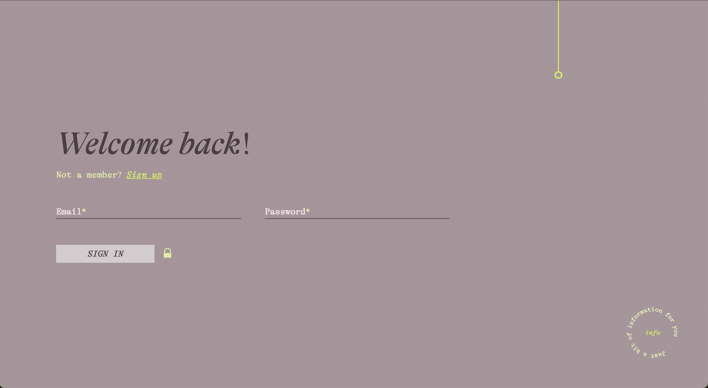

# Simple sign in / sign up form

<!--  -->

<!--  -->

I've crafted a simple web application running on an Apache server which follows a mirror folder structure applying hexagonal architecure and DDD principles in both Front-end and Back-end.

The Front-end services fetch data via input/output stream providers from the Back-end controllers with php://input (no routing). The Back-end is implemented with pure PHP(no Composer install) since I didn't want to use libraries or routers that could increase complexity.

The front-end source code is isolated from the user interface folder, with main.ts acting as a UI adapter, which connects browser events with application services. No front-end libraries have been used, but Node is required for TypeScript and Vite. All animations and interactions have been crafted from scratch.

The purpose of this project was to create a reusable application structure following good practices of software architecture, code quality and accessibility. And that would let me focus on design and UX without concerning about business logic.

## Back-end Architecture
```
back/
  |--config/
	|-- dbConfig.php
	|-- db.sql
  |--controller/
	|-- SignInController.php
	|-- SignUpController.php
  |--src/
	|-- User/
		|-- Domain/
			|--User.php
			|--UserRepositoryInterface.php
			|--ValueObjects/
					|--Email.php
					|--Password.php
		|-- Application/
			|--SignInService.php
			|--SignUpService.php
		|-- Infrastructure/
			|--Connection.php
			|--UserRepository.php
```

## Front-end Architecture

```
front/
	|--src/
		|-- AppAdapters.ts
		|-- User/ 
			|-- Domain/
				|--User.ts
				|--UserRepositoryInterface.ts
				|--ValueObjects/
				|--Exceptions/
			|-- Application/
				|--SignInService.ts
				|--SignUpService.ts
			|-- Infrastructure/
				|--MysqlUserRepository.ts
				|--JsonMockUserRepository.ts
	|--ui/
	|-- assets/
		|--fonts/
		|--imgs/
	|-- components/
	|-- styles/
	|-- main.ts
```

## Installation & usage

### Full version (Back-end + Front-end)

In the full version of the application, the front-end services connect to the back-end controllers via a MySQL repository. This version requires both the back-end and front-end servers to be running.

Requirements:

- Apache Server
- MySQL
- Node.js & npm
- Vite

Steps:

1. Clone the repository:

```bash
git clone https://github.com/HadalyVillasclaras/simple-form-hexagonal.git
```

2. Start the Apache and MySQL servers.

3. Update the Front-End adapater file to use the MysqlUserRepository in `front/src/AppAdapter.ts` :

```bash
const userRepository = new MysqlUserRepository();
this.signUpService = new SignUpService(userRepository);
this.signInService = new SignInService(userRepository);
```

4. Navigate to the front-end directory and install dependencies:

```bash
cd front
npm install
```

5. Start the front-end server:

```bash
npm run dev
```

---

### Front-end only version

The front-end only version of this application uses a static JSON file to mock the behavior of the back-end server. This allows you to test and explore the front-end user interface without having to set up the back-end server and database.

You can check out this version live here: [Simple form project](https://hadalyvillasclaras.github.io/simple-form-hexagonal/). Please note that since this version uses a static JSON file to mimic the back-end server, any data you input won't be stored or manipulated as it would be in the full version of the application.

Requirements:

- node.js & npm
- Vite

Steps:

1. Clone the repository:

```bash
git clone  https://github.com/HadalyVillasclaras/simple-form-hexagonal.git
```

2. Update the Front-End adapater file to use the JsonMockUserRepository in `front/src/AppAdapter.ts` :

```bash
const userRepository = new JsonMockUserRepository();
this.signUpService = new SignUpService(userRepository);
this.signInService = new SignInService(userRepository);
```

3. Navigate to the front-end directory and install dependencies:

```bash
cd front
npm install
```

4. Start the front-end server:

```bash
npm run dev
```
